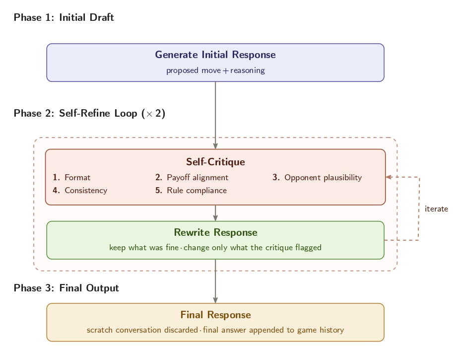
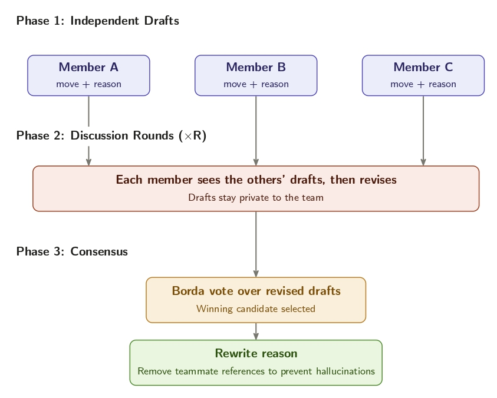

# Inference-Time Techniques for Open-Weight Language Models in Negotiation Games

Benchmarking open-weight LLMs in two-party negotiation games, and testing whether two inference-time techniques (Self-Refine and team deliberation) are worth their extra cost.

This repository is a fork of [NegotiationArena](https://github.com/vinid/NegotiationArena) (Bianchi et al., ICML 2024) and contains the code, experiments, and analysis for my MSc dissertation (Master's in Artificial Intelligence, FEUP/FCUP, University of Porto). It extends the original framework with local open-weight inference, a parse-error retry loop, Self-Refine agents, team negotiation, and SLURM/Kaggle execution.

**[Read the dissertation (PDF)](context/MSc_Thesis/main.pdf)**

## Overview

The original NegotiationArena evaluation covered only proprietary models, some of which have since been discontinued. This dissertation replays its three negotiation games with **nine open-weight models** from three families (**Gemma, Mistral, Qwen**) across three parameter tiers (**4–9B, 12–14B, 24–27B**), and then measures the effect of two inference-time techniques: **Self-Refine**, where an agent critiques and rewrites its move before committing it, and **team negotiation**, where one party is replaced by three models that draft, discuss, and vote on a joint move.

<p align="center">
  
</p>
<p align="center"><em>Cross-play win rate by family and parameter tier. Qwen is the most consistent family, winning 63–67% of games overall.</em></p>

## Research Questions

- **RQ1**: How well do open-weight LLMs perform in negotiation scenarios?
- **RQ2**: As inference-time techniques have shown promise in other settings, to what extent do they affect outcomes in multi-agent negotiation contexts?
  - **RQ2.1**: Do the social-persona effects that raised GPT-4's win rate and payoff transfer to open-weight models?
  - **RQ2.2**: Does a draft → critique → rewrite (Self-Refine) loop improve an agent's negotiation outcomes enough to justify its additional inference cost?
  - **RQ2.3**: Does replacing a single negotiating party with a deliberating team of models improve outcomes over a single agent, and does team diversity (homogeneous versus heterogeneous) matter?

## The Games

| Game | Description | Default setup |
|------|-------------|---------------|
| **BuySell** | A seller with a private production cost and a buyer with a private willingness to pay negotiate the price of an object, or walk away. | Seller cost 40 ZUP, buyer value 60 ZUP, buyer budget 100 ZUP |
| **Trading** | Two agents hold complementary resource bundles and exchange resources to maximize their final holdings. | P1 `{X:25, Y:5}`, P2 `{X:5, Y:25}` |
| **Multi-Turn Ultimatum** | A proposer splits a pot; the responder may accept, counter, or reject. | 100 ZUP pot |

Every game is an alternating conversation where moves are structured XML tags inside free-form messages. Reported metrics are **win rate** (share of completed, non-tied games won), **average payoff** (game-specific surplus, in ZUP where applicable), and **completion rate** (share of games reaching a valid terminal state).

## Models

| Tier | Gemma | Mistral | Qwen |
|------|-------|---------|------|
| `very_small` (4–9B) | Gemma 3 4B IT | Ministral 3 8B | Qwen3.5 9B |
| `small` (12–14B) | Gemma 3 12B IT | Ministral 3 14B | Qwen3 14B |
| `medium` (24–27B) | Gemma 3 27B IT | Mistral Small 3.2 24B | Qwen3.5 27B |

Models run locally through HuggingFace `transformers` (`ratbench/agents/hf_agent.py`). Gemma and Qwen use 8-bit quantization at the largest tiers; Qwen runs with thinking disabled. Model groups are defined once under `_shared` in `configs/experiments.yaml`.

## Inference-Time Techniques

### Self-Refine

Before committing a move, the agent drafts it, critiques the draft along five negotiation-specific axes (format, payoff alignment, opponent plausibility, consistency, and rule compliance), and rewrites it. The critique/rewrite loop runs twice, and only the final move enters the public game history.

<p align="center">
  
</p>
<p align="center"><em>The Self-Refine loop: initial draft, two critique/rewrite iterations, final commit.</em></p>

### Team Negotiation

One negotiating party is replaced by a private team of three models. Members draft moves independently, revise them over two discussion rounds while seeing each other's drafts, and rank the final slate; a Borda count selects the move the team commits.

<p align="center">
  
</p>
<p align="center"><em>The team deliberation protocol: independent drafts, discussion rounds, Borda consensus.</em></p>

## Repository Structure

```text
MultiAgent-Negotiation/
├── ratbench/                  # Core framework
│   ├── agents/                #   HF agent, Self-Refine agent, team agent
│   ├── alternating_game.py    #   Game engine, parse-error retry loop, trace logging
│   └── game_objects/          #   Resource, Valuation, Trade, Goal primitives
├── games/                     # BuySell, Trading, Multi-Turn Ultimatum
├── runner/run_experiment.py   # Experiment runner (config-driven)
├── configs/experiments.yaml   # Single source of truth for all experiments
├── .logs/                     # Experiment results (game states + full transcripts)
├── slurm/                     # HPC launchers and server profiles (MIA, Deucalion)
├── kaggle/                    # Free-GPU execution via Kaggle kernels
├── explorer/                  # Streamlit app to browse games and analyses
├── _notebooks/oss/            # Analysis notebooks that generate all figures
└── context/MSc_Thesis/        # The dissertation (LaTeX source + PDF)
```

## Getting Started

```bash
pip install -r requirements.txt
```

Run an experiment locally (all experiments are defined in `configs/experiments.yaml`):

```bash
# Section-one benchmark cross-play for BuySell
python runner/run_experiment.py --config configs/experiments.yaml --experiment buysell_section_one

# A single Self-Refine game, useful for smoke-testing
python runner/run_experiment.py --config configs/experiments.yaml --experiment trading_self_refine_v1 --num_runs 1

# Pick a different model tier
python runner/run_experiment.py --config configs/experiments.yaml --experiment buysell_section_one --model_group medium

# Resume an interrupted sweep, topping every cell up to 30 runs
python runner/run_experiment.py --config configs/experiments.yaml --experiment trading_section_one --resume --target_runs 30
```

Browse results in the Streamlit explorer:

```bash
streamlit run explorer/app.py
```

The explorer includes pages for reading full game conversations (with Self-Refine and deliberation traces), tracking experiment completion, and per-section analyses (benchmark, personas, Self-Refine, team negotiation, Kaggle runs).

<details>
<summary><strong>SLURM clusters (MIA, Deucalion)</strong></summary>

Experiments are launched through server profiles in `slurm/servers/`:

```bash
# Run all experiments on MIA
SERVER=mia bash slurm/launch.sh

# One experiment, one tier, on Deucalion
SERVER=deucalion EXPERIMENTS="buysell_section_one" SIZES="small" bash slurm/launch.sh

# Preview the sbatch commands without submitting
SERVER=deucalion DRY_RUN=1 bash slurm/launch.sh
```

Every SLURM parameter can be overridden at launch time:

| Variable | Description | Example |
|----------|-------------|---------|
| `SERVER` | Server profile (required) | `mia`, `deucalion` |
| `PARTITION` | SLURM partition | `normal-a100-80`, `dev-a100-40` |
| `GPUS` | Number of GPUs | `1`, `2`, `4` |
| `TIME` | Wall-time limit | `4:00:00`, `48:00:00` |
| `CPUS` | CPUs per task | `8`, `32`, `128` |
| `MEM` | Memory | `32G`, `64G` |
| `QOS` | Quality of service | `gpu_batch` |
| `ACCOUNT` | Billing account | `F20240001g` |
| `EXPERIMENTS` | Space-separated experiment names | `"buysell_section_one trading_section_one"` |
| `SIZES` | Space-separated model groups | `"very_small small"` |
| `DRY_RUN` | Preview without submitting | `1` |

To add a new server, create a profile at `slurm/servers/<name>.sh` and launch with `SERVER=<name>`. On Deucalion, fill in `PROJECT_DIR` and `GPU_ACCOUNT` in its profile first; GPU partitions have no internet access, so models must be pre-downloaded (`download_models.py`).

</details>

<details>
<summary><strong>Kaggle free GPUs</strong></summary>

Experiments can be submitted as Kaggle kernels. Each kernel clones the repo, runs the experiment, and pushes results back to a `kaggle-results/<experiment>-<size>-<ref8>-<timestamp>` branch:

```bash
# Submit experiments (optionally with a named account profile from kaggle/accounts/)
EXPERIMENTS="buysell_section_one" SIZES="very_small" KAGGLE_ACCOUNT=<name> bash kaggle/launch.sh

# Check kernel status without opening the browser
bash kaggle/status.sh --all-accounts --recent

# Retrieve results
git fetch && git branch -r | grep kaggle-results/
```

If the git push fails, a `results.tar.gz` is left in the kernel output and can be fetched with `kaggle kernels output <owner>/<slug> -p ./results/`.

| Variable | Description | Default |
|----------|-------------|---------|
| `KAGGLE_ACCOUNT` | Profile name under `kaggle/accounts/` | (system default) |
| `KAGGLE_GPU_TYPE` | GPU accelerator | `NvidiaTeslaT4` |
| `GIT_REF` | Commit to run | `HEAD` |
| `EXPERIMENTS` | Space-separated experiment names | section-two defaults |
| `SIZES` | Space-separated model groups | `none` |
| `DRY_RUN` | Preview without submitting | not set |

</details>

## How It Works

- **Game engine** (`ratbench/alternating_game.py`): agents alternate turns in a shared conversation; moves are parsed from structured tags. When parsing fails, a **retry loop** feeds the parser error back to the agent and asks it to regenerate, up to `max_retries` times. This recovers most protocol failures of smaller models and is ablated separately (`*_retry3` experiment variants).
- **Self-Refine** (`ratbench/agents/agent_behaviours.py`): implements the loop described above; the full draft/critique/rewrite trace is persisted per turn alongside the game state.
- **Team negotiation** (`ratbench/agents/negotiation_team_agent.py`): implements the deliberation protocol; the winning rationale is rewritten in first person so the public history never references teammates, and the full deliberation trace is persisted per turn.
- **Analysis**: the four notebooks in `_notebooks/oss/` (cross-play benchmark, personas, Self-Refine, team negotiation) consume `.logs/` and regenerate all result figures in the dissertation.

This work builds on:

- **NegotiationArena**: Bianchi et al., *How well can LLMs negotiate? NegotiationArena platform and analysis*, ICML 2024.
- **Self-Refine**: Madaan et al., *Self-Refine: Iterative refinement with self-feedback*, NeurIPS 2023.
- **RECONCILE**: Chen, Saha, and Bansal, *ReConcile: Round-table conference improves reasoning via consensus among diverse LLMs*, ACL 2024.
