1. # Cross-Play

## Completion & Format Correction

* **Completion does not scale uniformly with model size; Small models have a higher completion rate than medium;** 

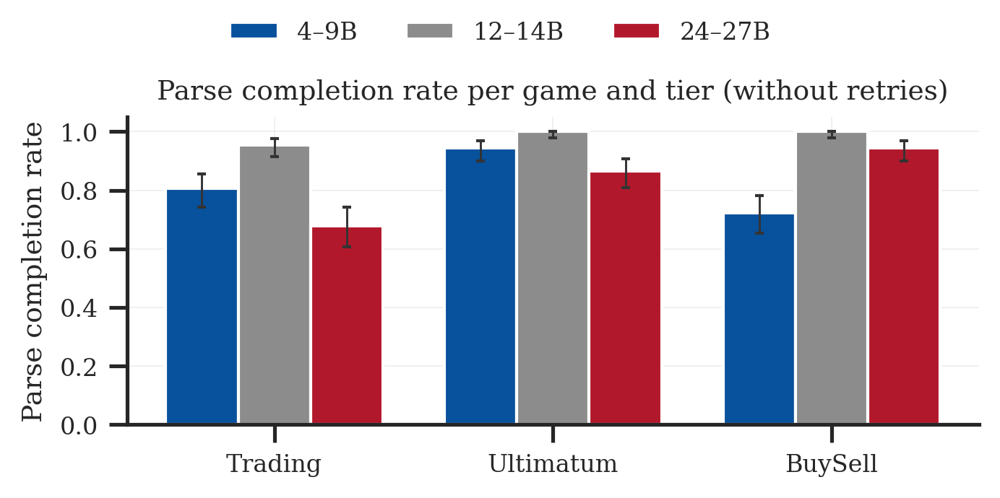

* **The main no-retry failure modes are game-specific:**  
  * Trading: missing \<player answer\> tags and unparseable resource amounts.  
  * BuySell: malformed trade lines, especially missing the | separator.  
  * Ultimatum: missing \<MOVE\> tags.

  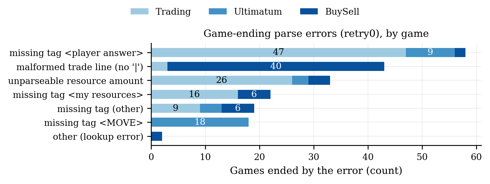

* **Failures are not evenly distributed across models:**

Gemma-3-4b-it is the largest source of failures;   
The low completion rate in the medium tier is is mainly driven by Qwen3.5-27B and Mistral-Small;

Even though Qwen is the family with the best overall negotiation performance, it’s the model family with the biggest percentage of failures

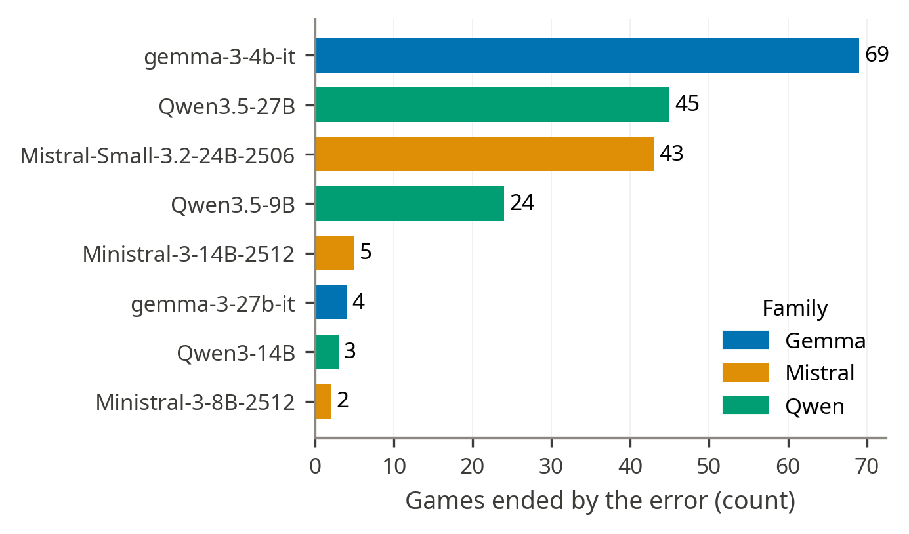

* **Self-Correction works**  
    
  Adding a self-correction loop nearly removes the completion problem. Retry3 reaches completion \>= 0.99 almost everywhere  
  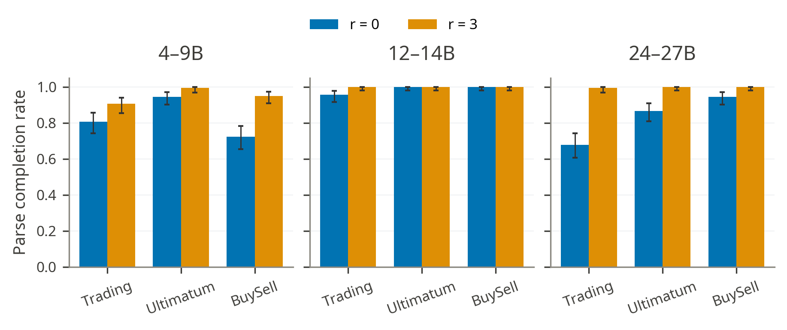

At the move level, **9.7% of moves trigger self-correction**. Of those malformed moves, **75% are fixed on the first retry**, and **only 28** / 1620 games **still fail** after the retry budget is exhausted. Qwen consumes the most retries, especially in Trading and Ultimatum, but this does not translate into the most fatal failures. Gemma retries less often but accounts for most unrecovered failures (weren’t fixed after 3 tries).

The majority of problems got solved on the first retry;  
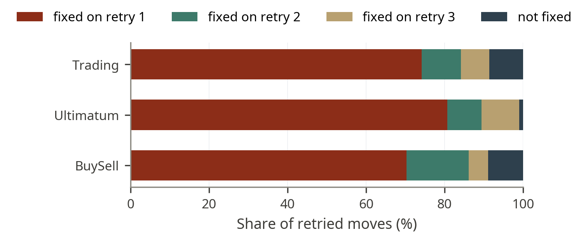

The retry loop does not materially change who wins. The family ranking remains stable when comparing no-retry and retry3 outcomes:  
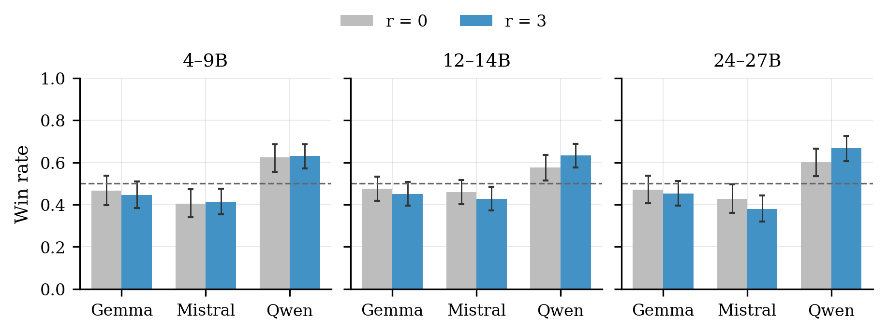

## 

## 

## Negotiation Performance

We now analyze the negotiation skills of the different models; The following plots are from the logs with max\_retries=3

* **Models hierarchy maintains across parameter tiers: Qwen is the strongest** (0.630 / 0.634 / 0.668)**, followed by Gemma**(\~0.44-0.45) **and Mistral** (0.38-0.43)

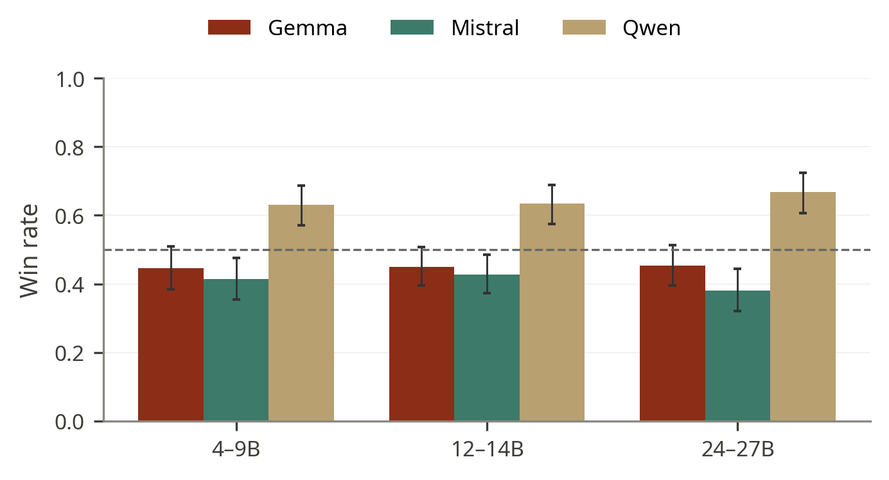

* **Analyzing at a game-level Gemma is the strongest model in the Ultimatum Game**

Qwen has its clearest advantages in Trading and BuySell, while Gemma is strongest in Ultimatum, especially at the medium tier.  
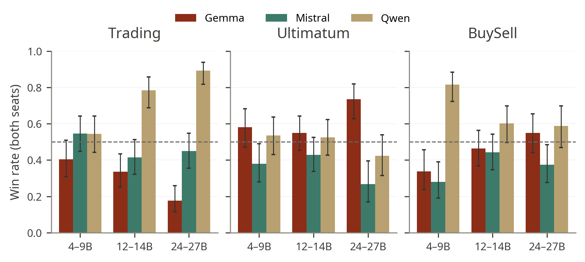

**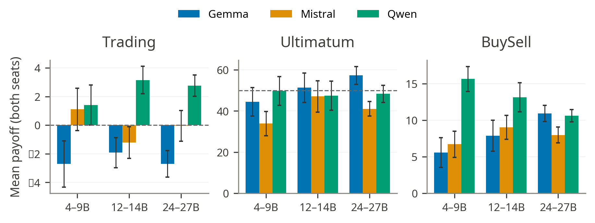**

* **Payoff mostly agrees with WinRate (Ultimatum is an exception)**

Win rate and payoff broadly agree in Trading and BuySell, where the correlation between win rate and normalized payoff is high (rho \= 0.92 in both games). 

In Ultimatum this correlation is smaller because some family/tier cells can win decisive games while still earning modest average payoff. If both models cannot agree on a split, the payoff is 0\. Gemma 4B rejects a high percentage of splits (see the plot below), so its payoff is lower than its win rate alone would suggest.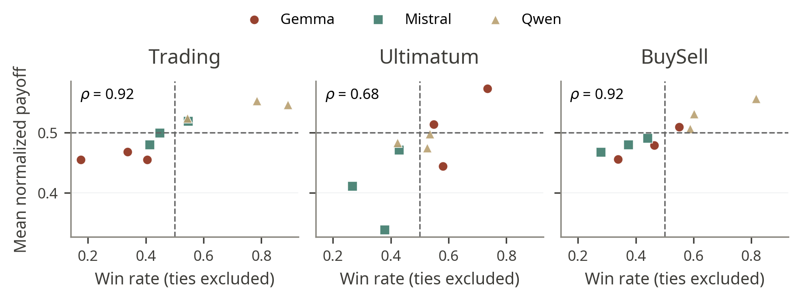

## Role and Turn

* **The role asymmetry reported in NegotiationArena also appears in open-weight models:**

\- Trading and BuySell: the second mover / P2 has an advantage;  
\- Ultimatum: the proposer / P1 has the advantage.  
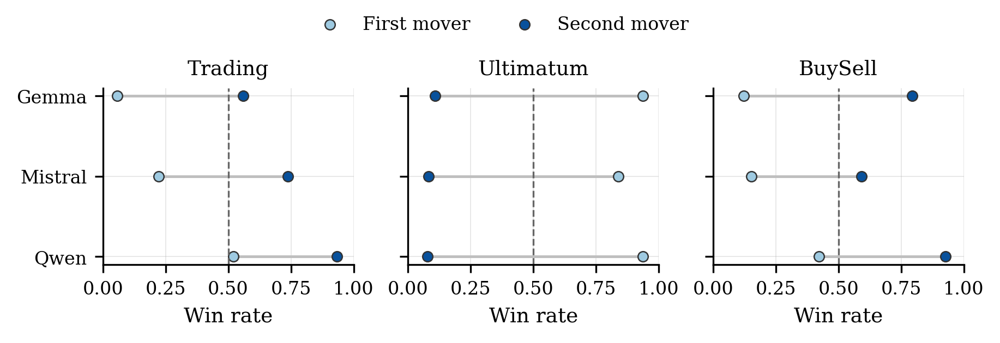

## 

## Game-Specific Analysis

* **Trading**

Qwen's win rate rises from 0.543 to 0.784 to 0.892 across tiers, while Gemma declines from 0.404 to 0.337 to 0.176. 

Medium Qwen3.5-27B is the strongest Trading model and dominates from both seats.

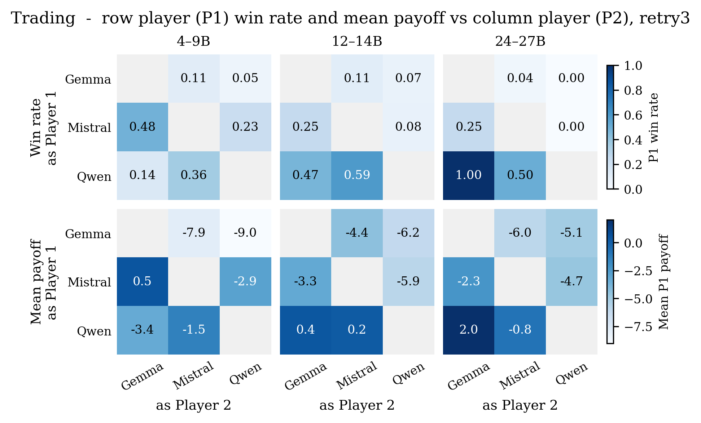

* **Ultimatum**

Ultimatum behaves differently from the other games. Gemma outperforms Qwen in win rate, and the proposer role(P1) dominates the result. 

**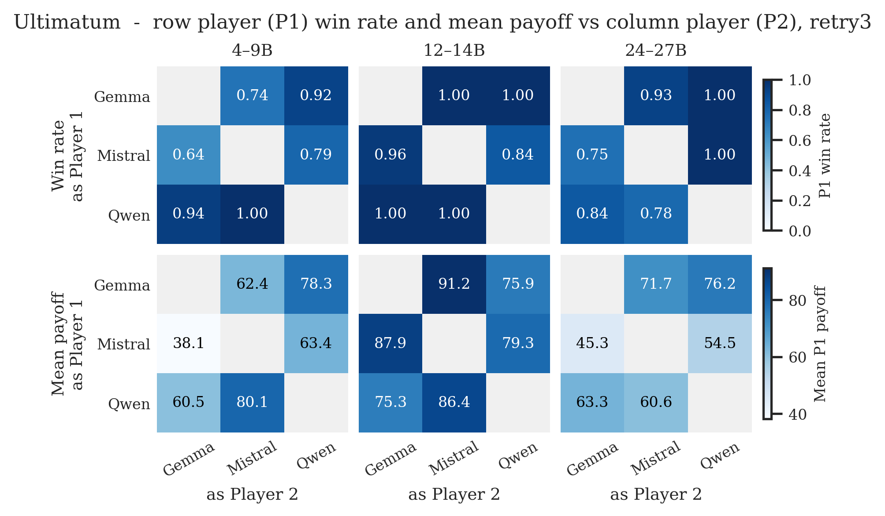**

There’s a clear family difference in opening offers: Mistral is the most generous proposer, while Gemma and Qwen tend to make more aggressive offers that keep more of the pot.

**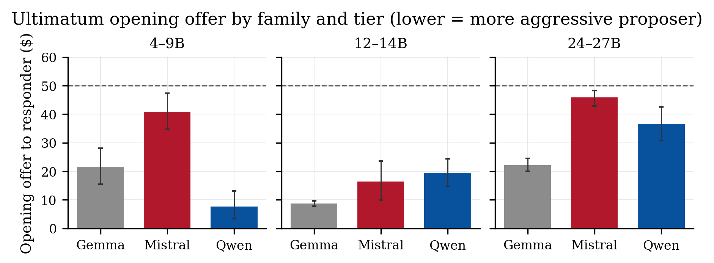**

In this game a rejection is a value-destroying move because both players receive zero. There are 35 Ultimatum games ending in rejection, mostly at the very-small tier (especially Gemma 4b that rejects 32.2% of splits). 

**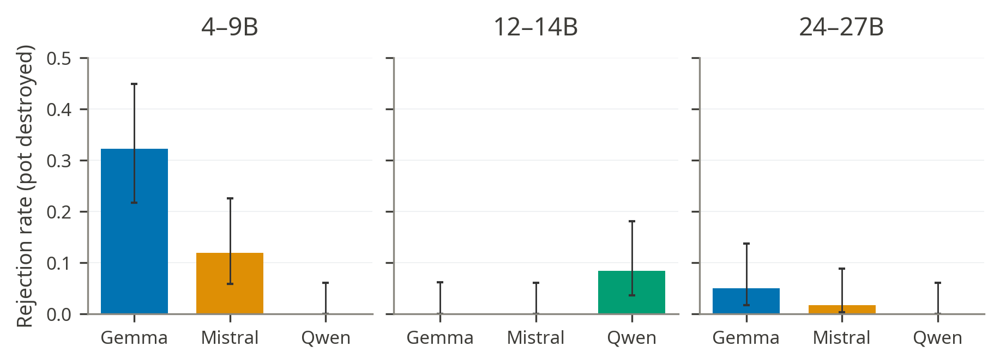**

* **BuySell**  
    
  **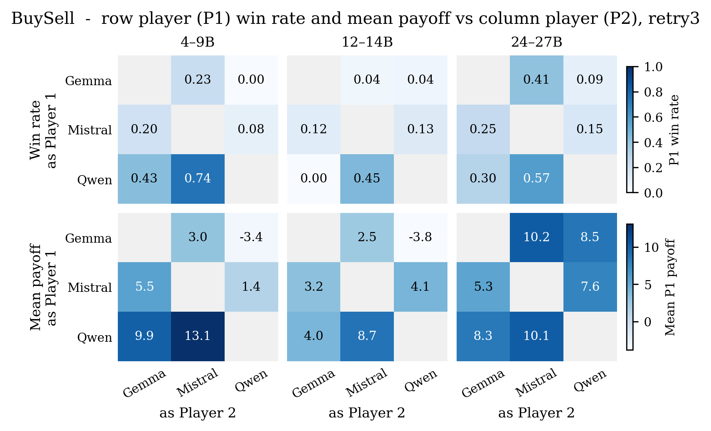**  
  As in NegotiationArena we observe a seller anchoring: the seller's opening price strongly correlates with the final agreed price (Spearman rho \= 0.75, compared with 0.716 for GPT-4 in NegotiationArena). In practice, sellers who open higher tend to close higher.  
    
  Gemma sellers often open too low, sometimes even below their own production cost of 40\. Gemma-3-12b-it is the clearest case: it opens below cost in 77% of seller games, and in 47% of completed deals the final price is below cost. Qwen sellers are much more rational, with below-cost opening only around 0-3%.  
    
    
  **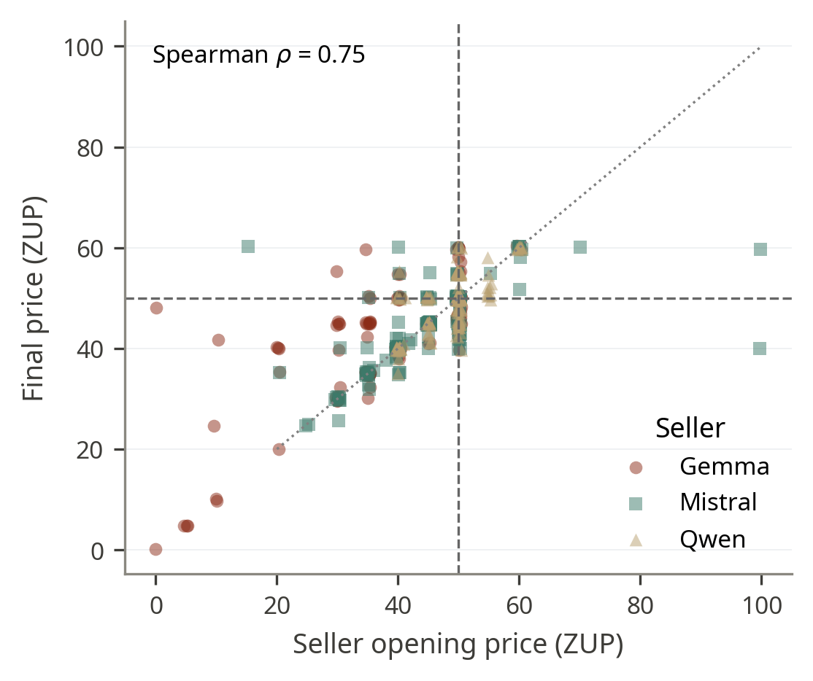**  
    
  The buyer captures more surplus. 55% of deals close below the midpoint price of 50, and 29% land exactly on 50\. The average surplus is about 14.3 dollars for the buyer versus 5.7 dollars for the seller.  
  **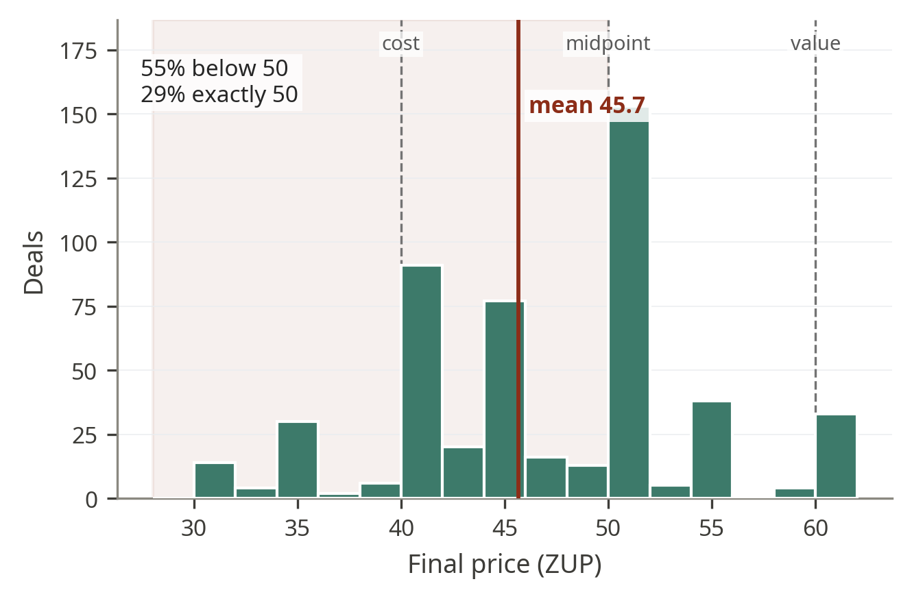**
