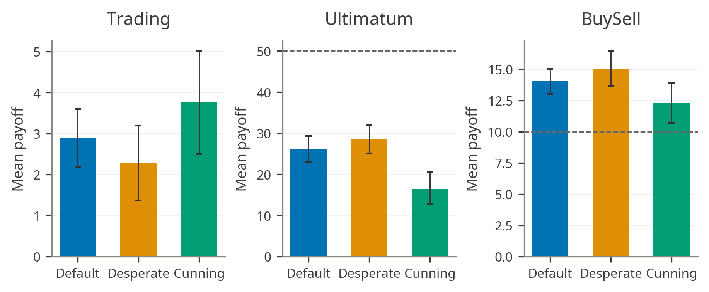
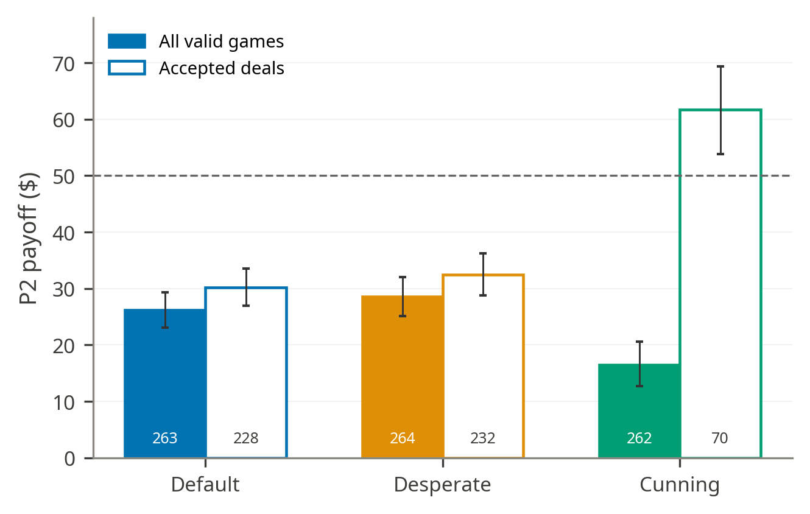
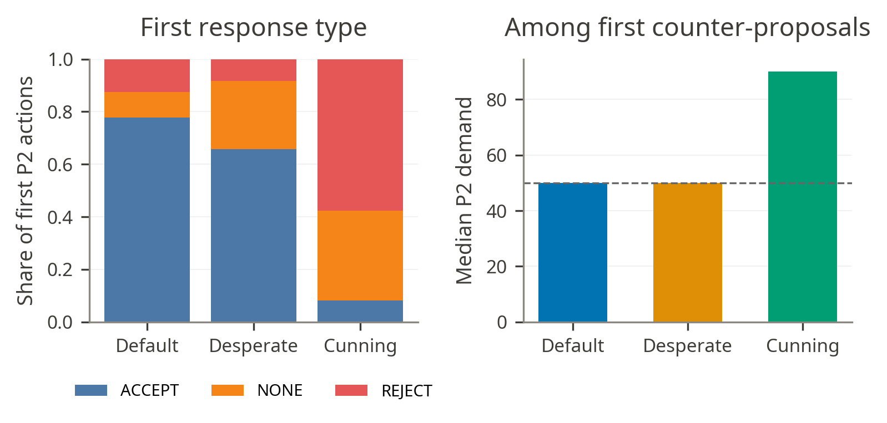
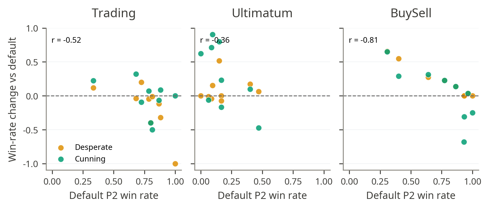
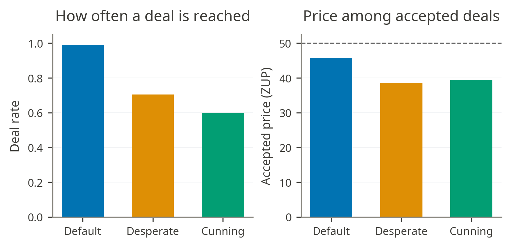

# 2\. Persona’s Impact

* **Persona’s effect is uneven across models**

- Bianchi et al’s report that on GPT-4 self-play cunning and desperate behaviors increase both win rate and payoff does not generalize cleanly across the open-weight models we tested. As we can see in the winrate delta heatmap below.

* **Cunning’s impact on ultimatum results: it increases the win-rate, but highly increases the no-deal rate**  
    
- Cunning produces the largest P2 win-rate gain, raising Ultimatum P2 wins from 0.143 to 0.705;

- But that result can be a bit deceiving. WinRate excludes draws (e.g when there’s a rejection in the Ultimatum game), so it’s important to look what happens with payoff

* **Cunning increases the no-deal rate, especially in the Ultimatum Game which leads to a sharp decrease in payoff**

- Cunning reaches accepted deals in only 0.267 of valid Ultimatum games

- This high no-deal rate is one of the reasons for Ultimatum’s sharp decrease in PayOff. P2 payoff falls from 26.19 under default to 16.48.   
    
    
* **In Ultimatum, being cunning is high-risk, high-reward (something Bianchi et al. reported with GPT-4) Cunning increases the no-deal rate, especially in the Ultimatum Game which leads to a sharp decrease in payoff**

- Cunning leads to a high number of no-deals, but when they do reach a deal the payoff is significantly higher (61.69 on average compared to 30.21 under default and 32.47 under desperate)

* **Personas change the first responder move and counter-proposals**

- Cunning only accepts 0.082 of first offers, rejects 0.577 and counter-proposes in 0.341 of games;  
- Cunning first counter-proposals are extreme: their median P2 demand is 90, and 0.670 of them demand at least 70 out of 100\.

* **Personas increase median demands**

- Across all Ultimatum offers, cunning pushes P2's median demand to 80 while P1's median offer to P2 remains 40, leaving a bargaining gap that the game rarely closes.  
- Desperate narrows the Ultimatum gap from both sides: P2's median demand rises to 60, while P1's median offer rises to 40\.

* **No-deals are mainly driven by P2 rejecting**  
- No-deals are driven mostly by the persona-bearing responder walking away: 165 of 264 completed cunning games end after P2 rejection, compared with 26 after P1 rejection. The percentage of P1 rejects increases when P2 is cunning

* **The increased No-deal rate when P2 is cunning is not isolated to one model family: no-deal rates are 0.787 for Gemma, 0.767 for Mistral, and 0.624 for Qwen.**

* **Model Heterogeneity**  
    
- Persona effects vary sharply by model rather than shifting all models in the same direction.  
- Ultimatum cunning has the largest average per-model win-rate gain, but also the widest spread: mean \+0.297 with spread 1.375 across models.

- Several models convert cunning into large Ultimatum gains, including gemma-3-27b at \+0.90, Qwen3.5-27B at \+0.80, Qwen3.5-9B at \+0.71, and gemma-3-12b at \+0.62.  
- Cunning is not universally helpful in Ultimatum: gemma-3-4b is roughly flat at \-0.06, and Ministral-3-8B-2512 falls by \-0.47.  
- BuySell cunning is especially model-dependent: its mean effect is only \+0.046, but its spread is 1.332, including a \-0.681 collapse for Qwen3-14B.  
- Tier effects should be treated cautiously: Ultimatum cunning is largest at the medium tier, but per-tier decided-game counts are small and the pattern is not monotonic.  
- Trading shows no consistent tier ordering for either persona, so model size does not provide a clear narrative there.

* **Extra plots:**

  

