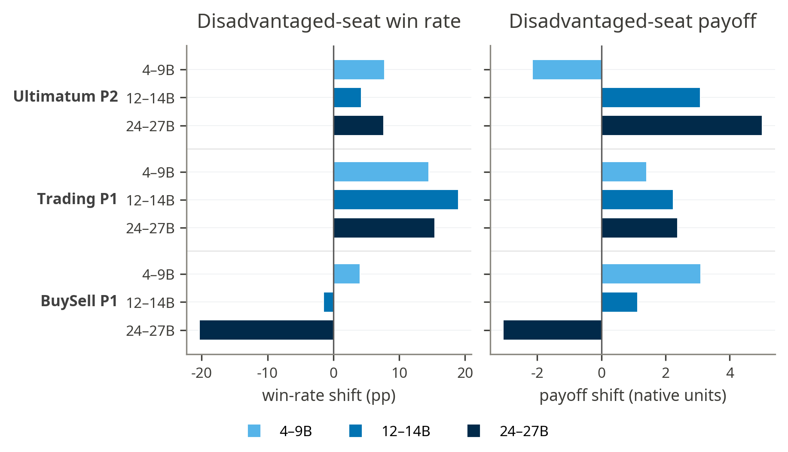
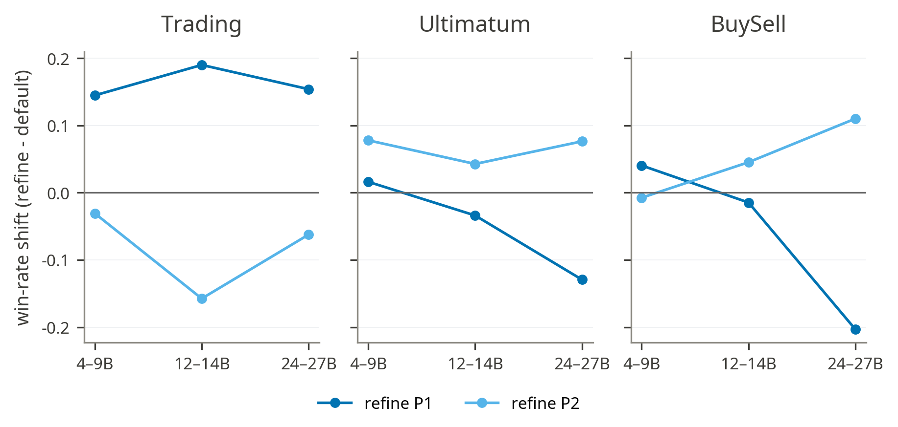
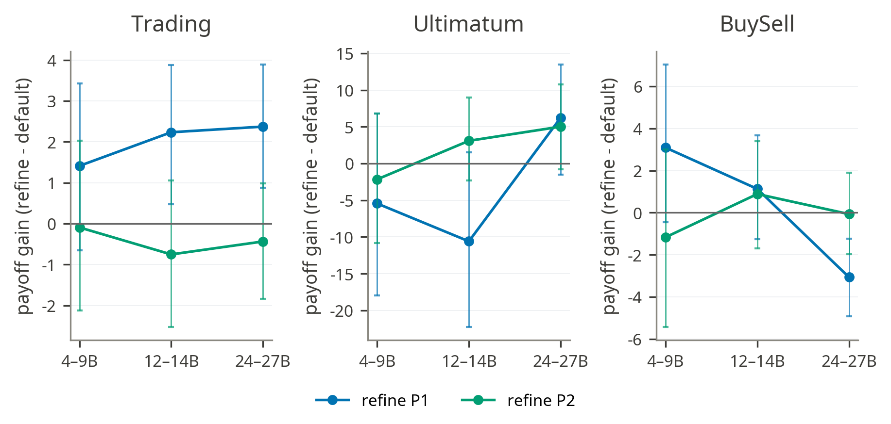
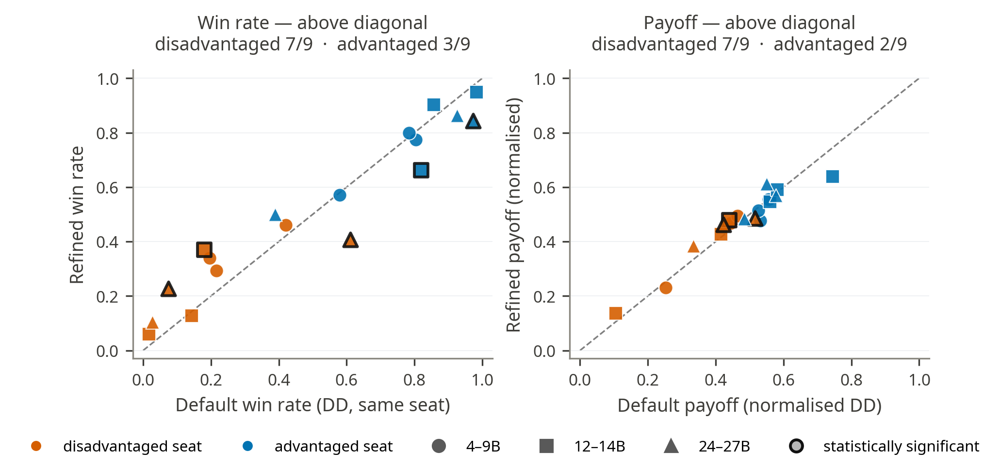
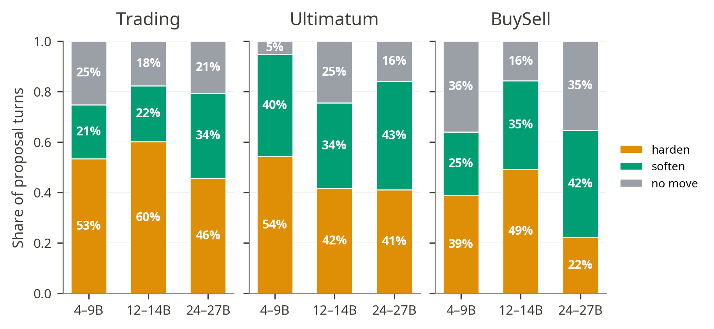
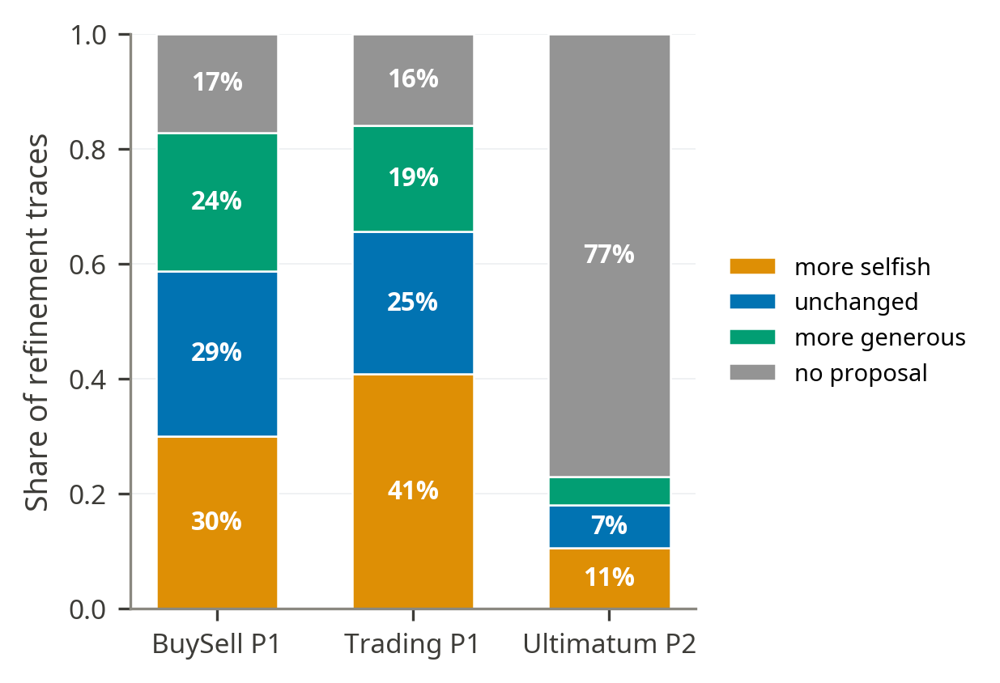
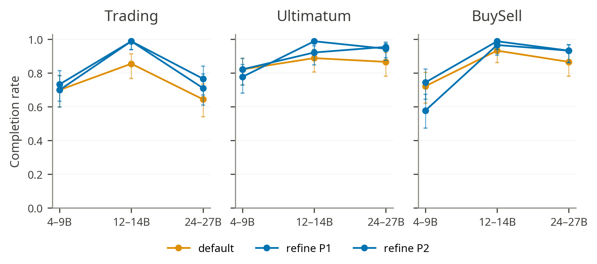
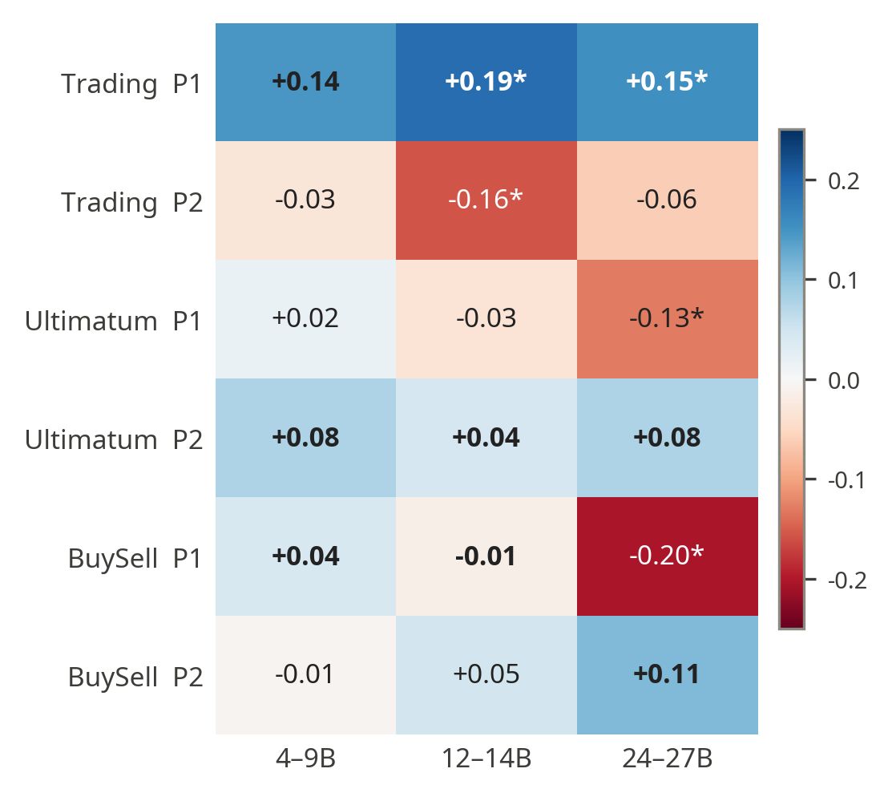
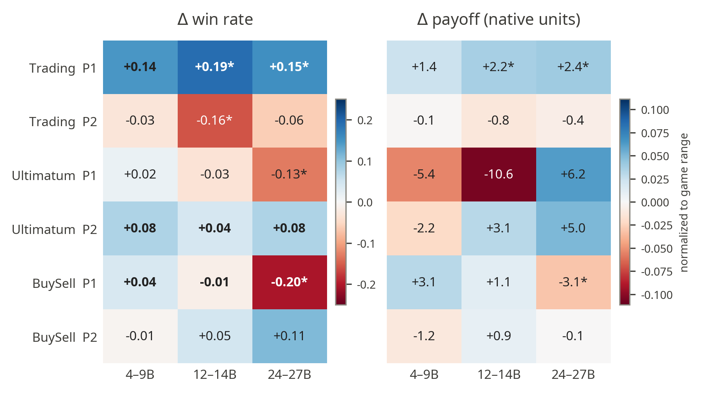

# 3\. Self-Refine

* **Self-refine mostly improves completion rate**  
    
- When starting from a disadvantaged seat, self-refine helps it in 7 of 9 game×tier cells (mean \+5.7 pp win rate and \+1.5 payoff) while refining the already-advantaged seat improves only 2–3 of 9 (mean −2.8 pp, −1.3).   
- Cleanest case: Trading P1 gains on both metrics in all three tiers. Lone exception: medium-tier BuySell P1, where that seller was already winning most of its games, so refinement backfires (−20.3 pp win rate, −3.1 surplus).

* **Win Rate**  
- Refining the disadvantaged seat lifts it (Trading P1 \+14–19 pp at every tier; Ultimatum P2 \+4–8 pp), while refining the already-strong seat tends to lose win rate (Trading P2 −3 to −16 pp; Ultimatum P1 −3 to −13 pp). BuySell is mixed and tier-dependent.

* **Payoff**  
- The only consistent, CI-backed payoff gain is Trading P1 (+1.4 / \+2.2 / \+2.4 native units across tiers; CI excludes 0 at small and medium). Elsewhere the effect is small and indistinguishable from zero, except for medium BuySell P1, which significantly loses surplus (−3.1). Ultimatum effects are swamped by very wide bootstrap CIs.

* **Payoff**

- One point per game × seat × tier (pooled across families), default on x, refined on y: the disadvantaged seat sits above the diagonal in 7 of 9 cells (the advantaged seat in 2–3 of 9), consistent across tiers. The statistically significant moves (ringed) are Trading P1 (small, medium) up on both win rate and payoff, and medium BuySell P1, Trading P2 (small) and Ultimatum P1 (medium) down.

  

* **Refinement hardens the weak seat's offer**  
- Parsing the initial draft vs the committed move, the loop hardens (asks for more) more often than it softens, most strongly in Trading (harden ≈ .46–.60, peaking at the small tier). A large share of loops make no move at all, so refinement often leaves the offer untouched.

- In the disadvantaged seats the revision tilts toward the agent's own payoff. Trading P1 hardens in 40.8% of traces against 18.6% softening, and BuySell P1 in 29.9% against 24.0%. Ultimatum P2 is harder to read, since 77.1% of its traces never change the offer in a parseable way, but its average ambition still comes out positive.

* **Completion Rate modestly improves**   
- Pooled across tiers, a refined seat reaches a valid terminal state at least as often as DD in every game (DR vs DD: BuySell 0.889/0.841, Trading 0.830/0.733, Ultimatum .904/.859). The lift is cleanest at the small tier (Trading 0.856 → 0.989); at the very-small tier it is noisy and can backfire (BuySell RD 0.58 vs 0.72), and completion is not monotone in model size.

  

* **Cost**  
  A refined move generates roughly 6× the text of a default move (median 4,900 characters vs 790).  
* **Full results**

