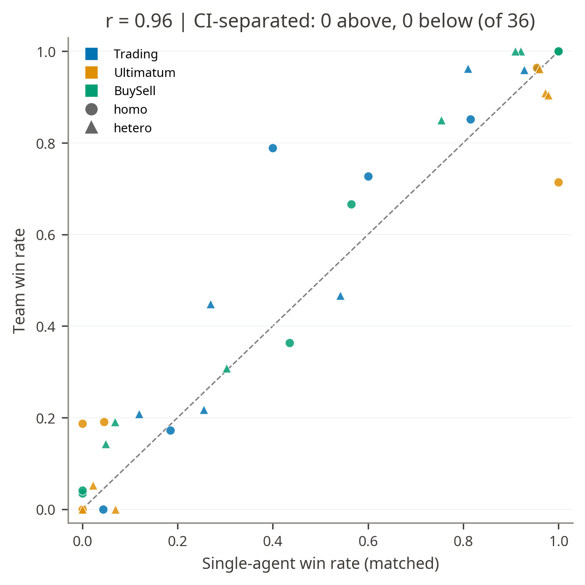
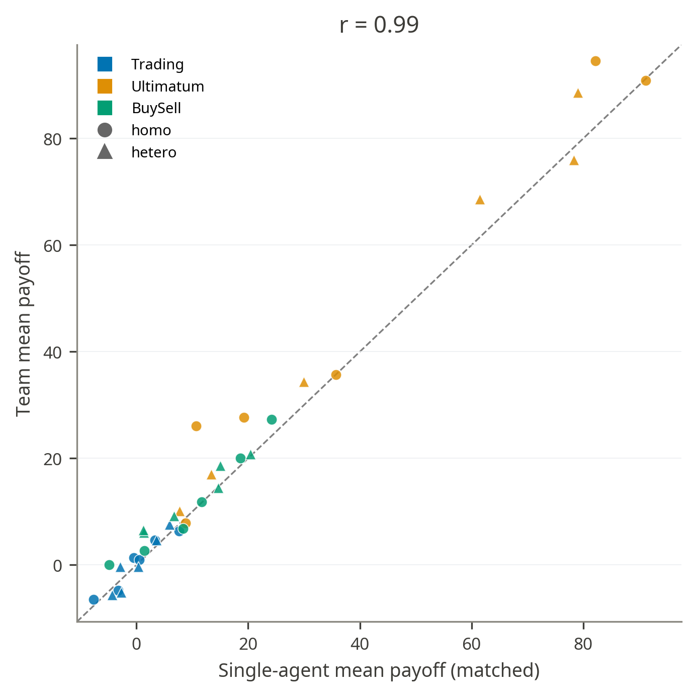
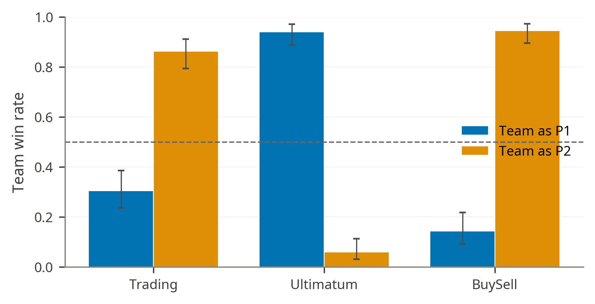
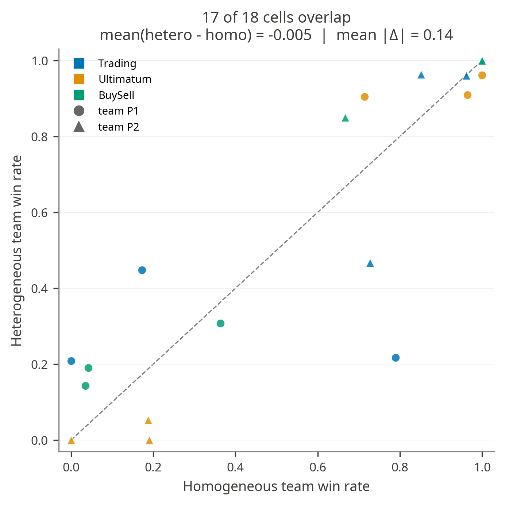
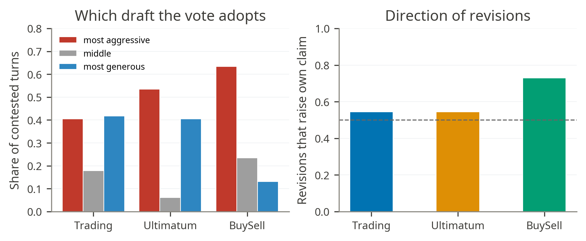
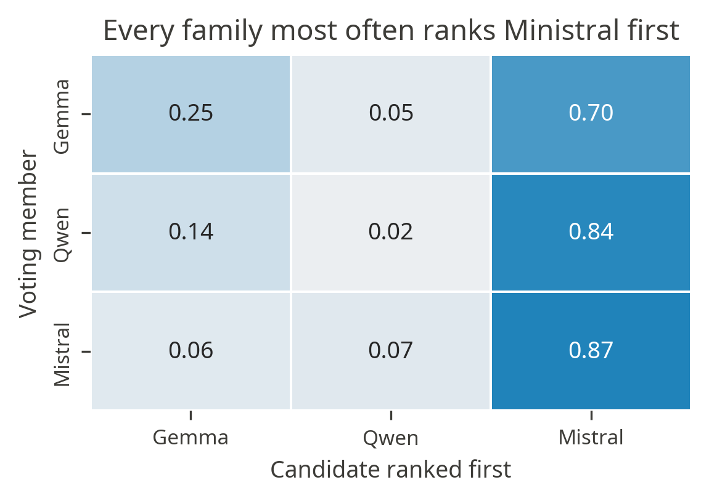
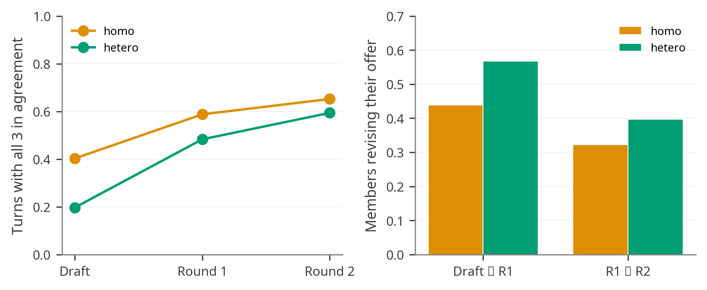
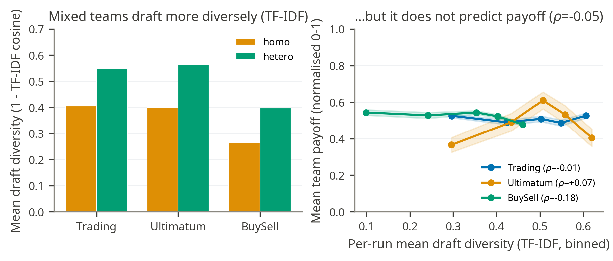

# 4\. Team-Based Negotiation

* **Team deliberation didn’t produce any negotiation advantage**  
    
- Across 36 matched cells (game x seat x composition x opponent), no win-rate interval separates the team from the matched single agent.  
- The average team-minus-single win-rate difference is only \+0.037.  
- Payoff is slightly more favorable to teams, but only locally: 9 of 36 payoff intervals favor the team and 0 favor the single agent, with an average gain of \+2.45.

* **Deliberation does not overcome the structural role asymmetry**  
- The team wins from the same seats that already advantage single agents: Trading and BuySell favor P2, while Ultimatum favors P1.

* **Heterogeneous teams do not outperform homogeneous ones**  
    
- Holding seat and opponent fixed, 17 of 18 homogeneous-vs-heterogeneous cells have overlapping intervals.  
- The mean heterogeneous-minus-homogeneous win-rate difference is essentially zero (-0.005).  
- The one apparent exception is Trading as P1 against Qwen

* **The heterogenous team favour Mistral’s move 80.5% of the time**  
- Gemma authors 0.174 and Qwen only 0.022, even though Qwen is the strongest single-agent family in the cross-play benchmark.  
- Gemma voters rank Ministral first 0.697 of the time, Qwen voters 0.835, and Ministral voters 0.868.

  
  

* **Deliberation rounds create convergence**  
- Members frequently revise their substantive offers, especially in round 1: heterogeneous teams change offer on 56.7% of draft-to-round-1 revisions and 39.7% of round-1-to-round-2 revisions.  
- Agreement rises through discussion: heterogeneous teams go from 0.197 full agreement at draft stage to 0.483 after round 1 and 0.594 after round 2\.

  

* **Draft diversity increases under heterogeneity, but it does not improve outcomes**

- Members frequently revise their substantive offers, especially in round 1: heterogeneous teams change offer on 56.7% of draft-to-round-1 revisions and 39.7% of round-1-to-round-2 revisions.  
- Agreement rises through discussion: heterogeneous teams go from 0.197 full agreement at draft stage to 0.483 after round 1 and 0.594 after round 2\.

  
