# 4\. Team-Based Negotiation

* **Team deliberation didn’t generally increase win rate**  
- Each of the 36 (game × seat × composition × opponent) cells plots team win rate vs. the same-model default self-play win rate. Points mostly follow the diagonal; no team-vs-default win-rate cell has separated confidence intervals, and the average lift is small relative to per-cell uncertainty.

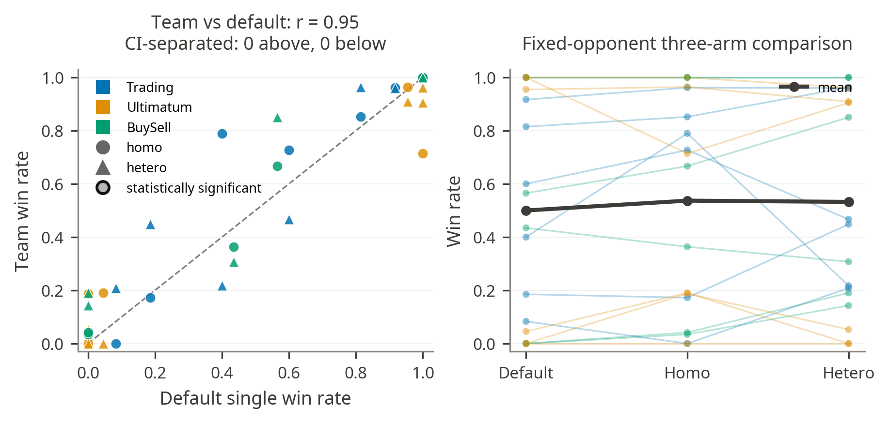

* **Payoff tells the same story**

- Mean team payoff sits near the default self-play baseline across cells; there are some local gains but not a not a broad negotiating advantage

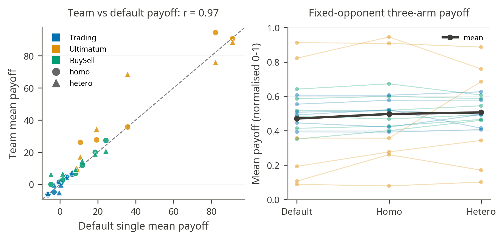

* **Homogeneous vs Heterogenous**  
- Heterogeneous-minus-homogeneous win rate differences scatter around the diagonal with little aggregate direction; There is no broad edge for heterogeneity

* **The gains that exist are concentrated and seat-specific**  
- The signed team-minus-default deltas (win rate left, mean payoff with bootstrap CI right) show most movement in payoff rather than win rate, and on the P1 side.

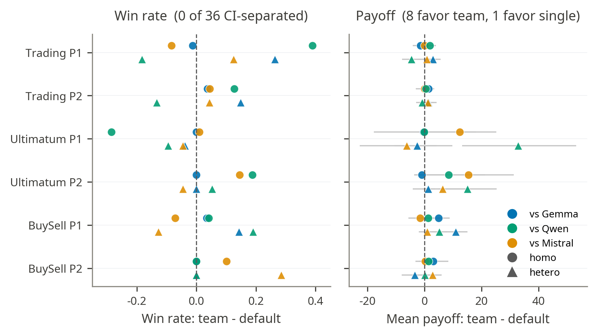

- The clearest win is the heterogeneous trio as BuySell seller (P1): pooled surplus \+7.1 ZUP vs \+1.6 for the fixed default agents (Δ \+5.6, CI \[3.3, 7.9\]), with CI-separated advantages against Gemma (+10.9) and Qwen (+5.2). Across all 36 cells, eight payoff intervals favour the team and one favours the single agent (Trading P1 hetero vs Qwen, −4.6); six of the eight team-favouring cells are P1 seats. Largest single gain: heterogeneous team as Ultimatum proposer vs Qwen (+32.8). The homogeneous Ministral team holds the highest absolute level (94.6/100 as Ultimatum proposer).

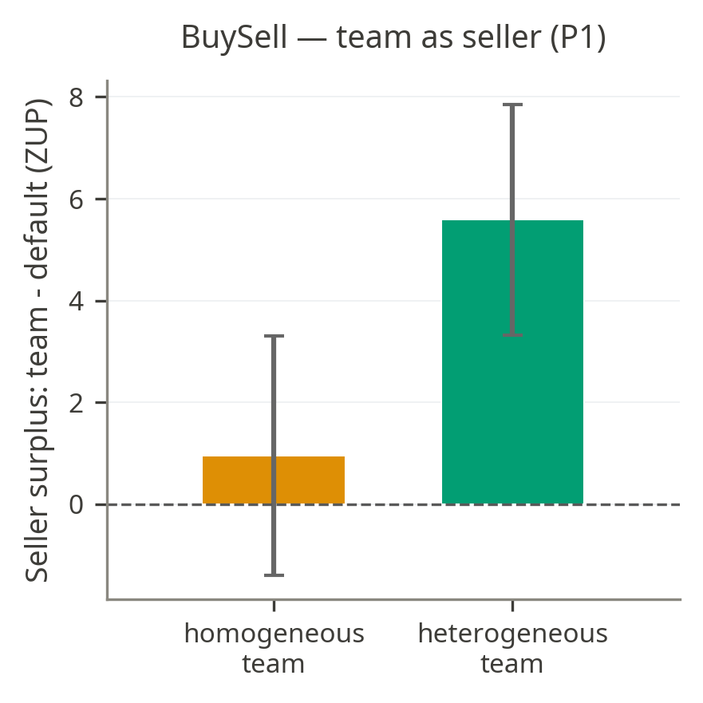  
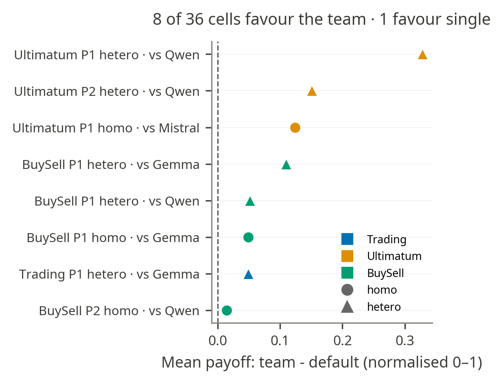

* **Ministral member's draft wins the Borda vote 80.5% of the time**  
- Across 650 committed heterogeneous moves, the Ministral member's draft wins the Borda vote 80.5% of the time. Gemma supplies only 17.4% of chosen moves and Qwen just 2.2% even though Qwen has the highest pooled family win rate in the cross-play retry-3 benchmark.

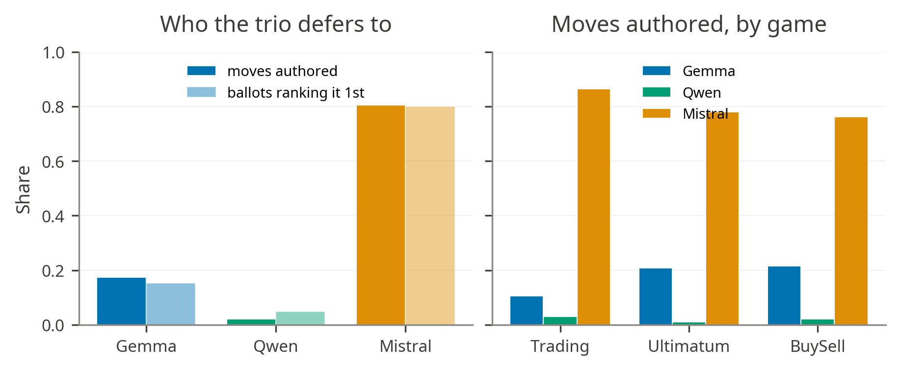  

* **More diverse drafting doesn’t produce better outcomes**  
- Within-turn draft diversity (mean pairwise cosine distance between the three drafts' TF-IDF vectors) is higher for heterogeneous teams in every game (≈0.50 vs ≈0.36),

**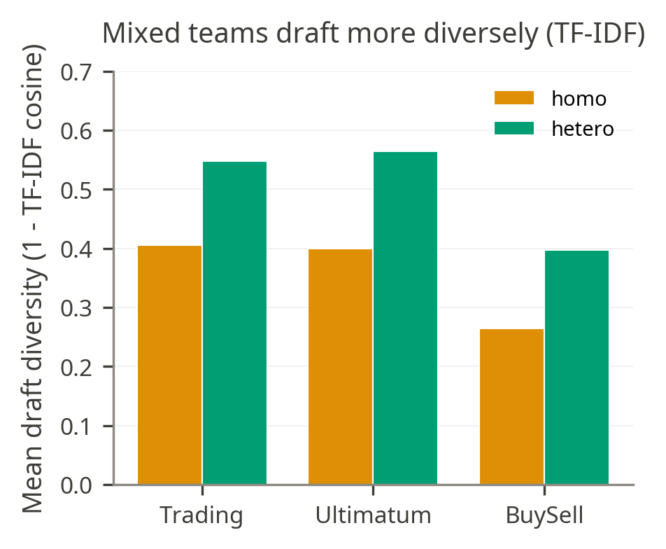**

- Across ≈1,000 valid runs it has essentially no association with normalised payoff (Spearman ρ ≈ −0.05, n.s.) and only a tiny, negative association with win rate (ρ ≈ −0.09, p \= 0.01)

**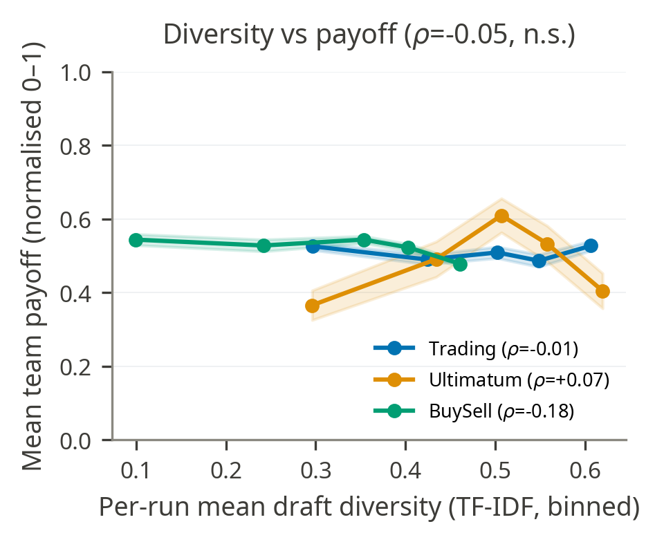**  
**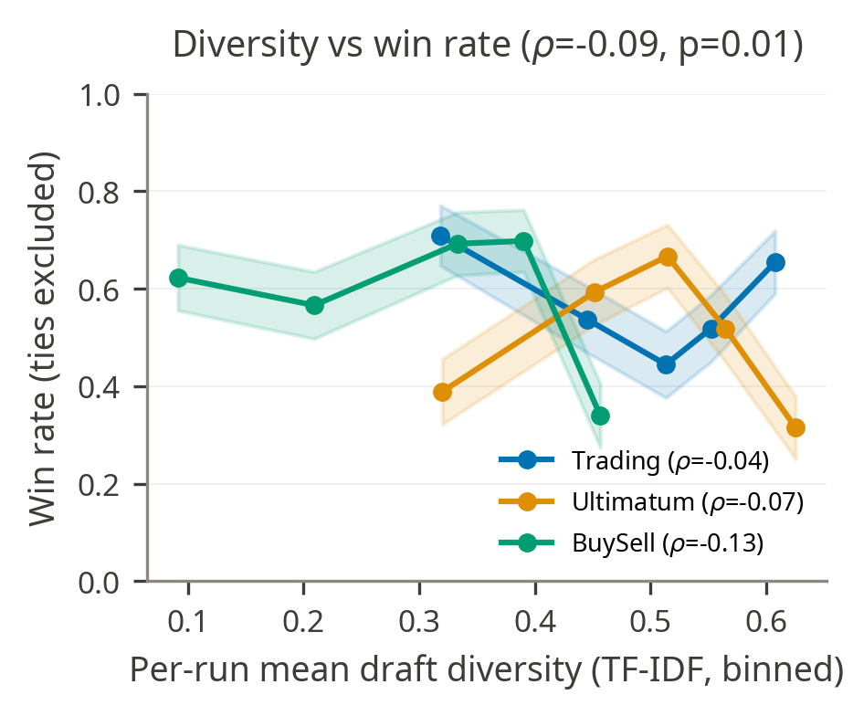**

* **Cost**

**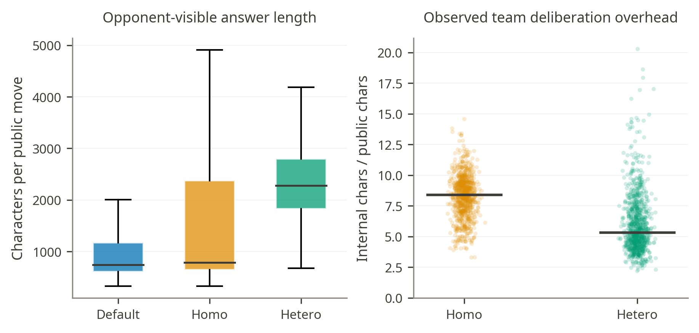**

* **Full Results**

**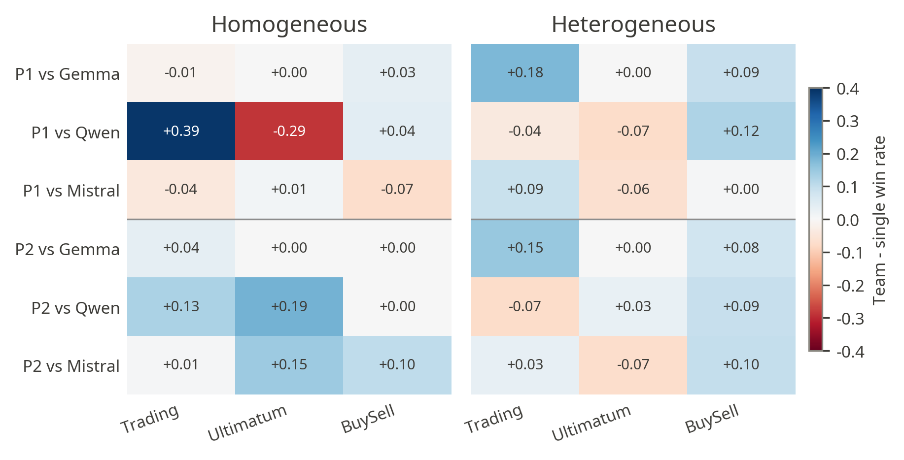**  
**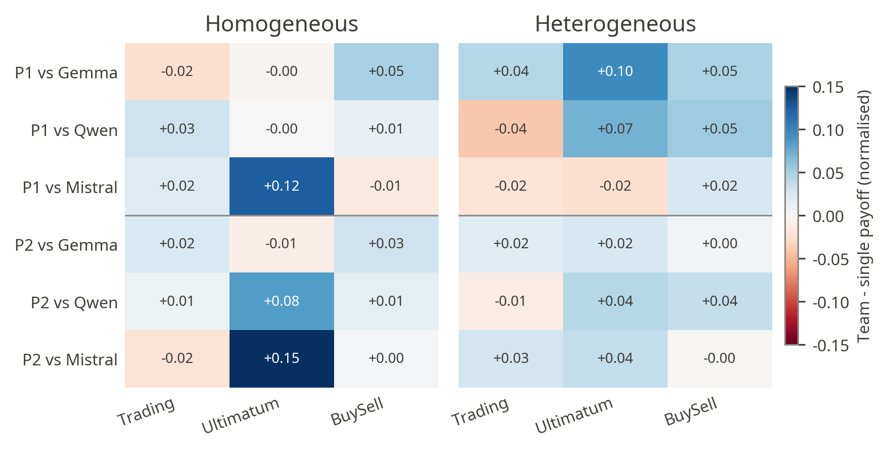**
